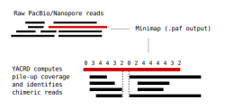

# Yet Another Chimeric Read Detector for long reads

[](https://travis-ci.org/natir/yacrd)



Using all-against-all read mapping, yacrd performs:

1. computation of pile-up coverage for each read
2. detection of chimeras

Chimera detection is done as follows:

1. for each region where coverage is smaller or equal than `min_coverage` (default 0), yacrd creates a _gap_.
2. if there is a gap that starts at a position strictly after the beginning of the read and ends strictly before the end of the read, the read is marked as `Chimeric`
3. if gaps length of extremity > 0.8 * read length, the read is marked as `Not_covered`

## Rationale

Long read error-correction tools usually detect and also remove chimeras. But it is difficult to isolate or retrieve information from just this step.

DAStrim (from the [DASCRUBBER suite](https://github.com/thegenemyers/DASCRUBBER) does a similar job to yacrd but relies on a different mapping step, and uses different (likely more advanced) heuristics. Yacrd is simpler and easier to use.

This [repository](https://gitlab.inria.fr/pmarijon/yacrd-and-fpa-upstream-tools-for-lr-genome-assembly) contains a set of scripts to evaluate yacrd against other similar tools such as [DASCRUBBER](https://github.com/thegenemyers/DASCRUBBER/) and [miniscrub](https://bitbucket.org/berkeleylab/jgi-miniscrub) on real data sets.

## Input

Any set of long reads (PacBio, Nanopore, anything that can be given to [minimap2](https://github.com/lh3/minimap2)).
yacrd takes the resulting PAF (Pairwise Alignement Format) from minimap2 or BLASR m4 file from some other long reads overlapper as input.

## Requirements

- [Rust](https://www.rust-lang.org/) in stable channel
- libgz
- libbzip2
- liblzma

## Instalation

### With cargo

If you have a rust environment setup you can run :

```
cargo install yacrd
```

### With conda

yacrd is avaible in [bioconda channel](https://bioconda.github.io/)

if bioconda channel is setup you can run :

```
conda install yacrd
```

### From source

```
git clone https://github.com/natir/yacrd.git
cd yacrd
git checkout v0.5.1

cargo build
cargo test
cargo install
```

## How to use Yacrd

### Find chimera

```
minimap2 reads.fq reads.fq | yacrd -o reads.yacrd
```

If you want save mapping intermediate file:
```
minimap2 reads.fq reads.fq > mapping.paf
yacrd chimeric -i mapping.paf -o reads.yacrd
```

### Find chimera and run post-detection operation

yacrd can perform thrid post-detection operation, on mapping or sequence file:

- filtering: yacrd generate a new file with only record without chimeric reads
- extracting: yacrd generate a new file with only record with chimeric reads
- spliting (only on sequence file) : yacrd generate a new file without chimeric region 

```
minimap2 reads.fq reads.fq > mapping.paf
yacrd chimeric -i mapping.paf -f reads.fasta > reads.yacrd # produce reads_fileterd.fasta
yacrd chimeric -i mapping.paf -e reads.fasta > reads.yacrd # produce reads_extracted.fasta
yacrd chimeric -i mapping.paf -s reads.fasta > reads.yacrd # produce reads_splited.fasta
```

### Read scrubbing

yacrd support a scrubbing mode to remove all not supported part of read.

For nanopore data, we recommand to use minimap2 with all-vs-all nanopore preset with maximal distance between seeds fixe to 500 (option `-g 500`) to generate overlap. We recommand to run yacrd with minimal coverage fixed to 4 (option `-c`) and minimal coverage of read fixed to 0.4 (option `-n`).

This is an exemple of how run a yacrd scrubbing:
```
minimap2 -x ava-ont -g 500 reads.fasta reads.fasta > overlap.paf
yacrd scrubbing -c 4 -n 0.4 -m overlap.paf -s reads.fasta -S reads_scrubbed.fasta -r scrubbed_report.yacrd
```

For pacbio P6-C4 data, we recommand to use minimap2 with all-vs-all pacbio preset with maximal distance between seeds fixe to 800 (option `-g 800`) to generate overlap. We recommand to run yacrd with minimal coverage fixed to 4 (option `-c 4`) and minimal coverage of read fixed to 0.4 (option `-n 0.4`).

```
minimap2 -x ava-pb -g 800 reads.fasta reads.fasta > overlap.paf
yacrd scrubbing -c 4 -n 0.4 -m overlap.paf -s reads.fasta -S reads_scrubbed.fasta -r scrubbed_report.yacrd
```

For pacbio Sequel data, we recommand to use minimap2 with all-vs-all pacbio preset with maximal distance between seeds fixe to 5000 (option `-g 5000`) to generate overlap. We recommand to run yacrd with minimal coverage fixed to 3 (option `-c 3`) and minimal coverage of read fixed to 0.4 (option `-n 0.4`).

```
minimap2 -x ava-pb -g 5000 reads.fasta reads.fasta > overlap.paf
yacrd scrubbing -c 3 -n 0.4 -m overlap.paf -s reads.fasta -S reads_scrubbed.fasta -r scrubbed_report.yacrd
```

## Output

```
type_of_read	id_in_mapping_file  length_of_read  length_of_gap,begin_pos_of_gap,end_pos_of_gap;length_of_gap,be…
```

### Example

```
Not_covered readA 4599	3782,0,3782
```

Here, readA doesn't have sufficient coverage, there is a zero-coverage region of length 3782bp between positions 0 and 3782.

```
Chimeric    readB   10452   862,1260,2122;3209,4319,7528
```

Here, readB is chimeric with 2 zero-coverage regions: one between bases 1260 and 2122, another between 3209 and 7528.

### JSON

If flag `-j` are present output are write in json format, an example:

```
{
	"1": {
		"gaps": [{
			"begin": 0,
			"end": 2000
		}, {
			"begin": 4500,
			"end": 5500
		}, {
			"begin": 8000,
			"end": 10000
		}],
		"length": 10000,
		"type": "Chimeric"
	},
	"4": {
		"gaps": [{
			"begin": 2500,
			"end": 3500
		}],
		"length": 6000,
		"type": "Chimeric"
	}
}
```

## Citation

If you use yacrd in your research, please cite the following publication:

```
Pierre Marijon, Rayan Chikhi, Jean-Stéphane Varré, yacrd and fpa: upstream tools for long-read genome assembly
```

bibtex format:
```
@article {Marijon2019,
	author = {Marijon, Pierre and Chikhi, Rayan and Varr{\'e}, Jean-St{\'e}phane},
	title = {yacrd and fpa: upstream tools for long-read genome assembly},
	elocation-id = {674036},
	year = {2019},
	doi = {10.1101/674036},
	URL = {https://www.biorxiv.org/content/early/2019/06/18/674036},
	eprint = {https://www.biorxiv.org/content/early/2019/06/18/674036.full.pdf},
	journal = {bioRxiv}
}
```
